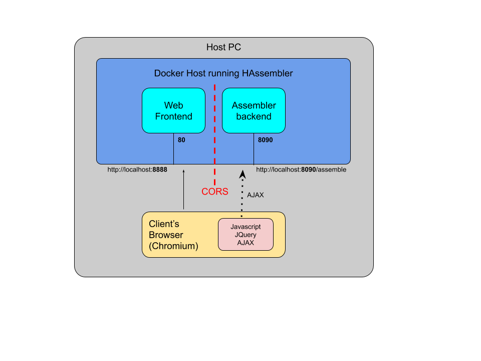

# HAssembler
## Hack Assembler

This project is a web based Assembler for the [Hack](http://www.marksmath.com/tecs/hack-asm/hack-asm.html) machine language.

## System structure
The system contains 2 services and a test client (browser)
1. Web frontend
2. Assrmbler backend




### Web frontend
Apache web server hosting a Javascript/JQuery page, provides the client with 2 textboxes:
* input: Hack code
* output: Binary representation

As soon as the client type a command into the input textbox, the binary representation updated automatically using AJAX.

### Assembler backend
Springboot service that implements the translation logic. It exposes a REST api /assembler that accepts  Hack code and returns the binary representation as string

## Build the project from source
When modifying the Assembler backend code, building is required.
Building the project is done by 2 steps:
1. compile the backend code to create the target executable using maven
```
# creating the target/Hassembler*.jar
$ mvn clean package
```
2. build a new docker image
```
# target/Hassembler*.jar is injected into the build environment
$ docker-compose build
```
NOTE: changing javascript files should be supported without any rebuilding, 
this is because the website folder is shared between the host and the frontend container.

## Running HAssembler
Running the project 

```
# starting the services
$ docker-compose up

# or run as daemon
$ docker-compose up -d

# or run in background and write to logfile
$ docker-compose up >> hassembler.log 2>&1 &  

```

## DevOps
### Orchestration
The services isolated using docker containers. 
Orchestration is done by Docker-compose technology 
as described in docker-compose.yml file.

### Web client and CORS
Since the 2 services are from different origins (domains), 
the client's browser may block AJAX requests to the backend. 
There are many ways to bypass the CORS, but since its out of the scope of this project. 
we will use a [Chromium](https://www.chromium.org/getting-involved/download-chromium) browser
with some flags to disable some security features, thus allowing CORS:
```
# start a test client
./start-client.sh
```

## DNS issues
Since the javascript is running on the client's browser,
we need to allow calling the backend from the browser. we can allow in 2 ways:
1. make a proper DNS configuration on the host and configure the javascript AJAX to call the backend
2. simply configure the javascript to post AJAX to localhost
we will use the 2nd option since its good enough when both containers are running on the same host


## TODO
1. fix CORS
2. fix Rect.asm example on javascript page

